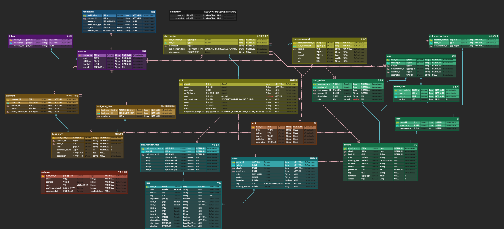

# 🏛️ Spring Modulith 아키텍처

---

## 1. 왜 Spring Modulith인가?

기존 Facade 패턴의 한계를 극복하기 위해 **Spring Modulith**를 도입했습니다.

### Facade 패턴의 한계

| 문제점    | 설명                        |
|--------|---------------------------|
| 강제 불가  | 팀 약속에 불과, 실수로 규칙 위반 가능    |
| 엔티티 참조 | 관계 설정 시 프록시 객체 반환으로 원칙 위반 |
| 검증 부재  | 모듈 경계 위반을 자동으로 검증할 방법 없음  |

### Spring Modulith의 해결책

| 해결 방법             | 설명                                             |
|-------------------|------------------------------------------------|
| **패키지 구조로 강제**    | `internal` 및 `web` 패키지는 외부 모듈에서 접근 불가 (IDE 에러) |
| **자동 검증**         | 테스트 코드로 모듈 경계 위반 자동 검증                         |
| **이벤트 기반 통신**     | 엔티티 참조 없이 이벤트로 모듈 간 통신                         |
| **Public API 명시** | 외부 노출 API를 명확히 정의                              |

---

## 2. Spring Modulith 모듈 구조

### 📁 패키지 구조 규칙

```
checkmo/
├── member/                          # Member 모듈
│   ├── MemberAPI.java              # ✅ Public API (외부 노출)
│   ├── MemberExternalDTO.java      # ✅ 공유 DTO (외부 노출)
│   ├── MemberEvent.java            # ✅ 이벤트 (외부 노출)
│   ├── internal/                   # ❌ 내부 구현 (외부 접근 불가)
│   │   ├── service/
│   │   ├── repository/
│   │   ├── entity/
│   │   └── listener/
│   └── web/                        # ❌ 웹 계층 (Controller, DTO, 외부 접근 불가)
│       ├── controller/
│       └── dto/
├── authentication/                  # Authentication 모듈
│   ├── AuthenticationAPI.java
│   ├── AuthenticationEvent.java
│   └── internal/
└── ...                              # 기타 다른 모듈들...
```

### 핵심 원칙

1. **`internal` 패키지**: 모듈의 내부 구현, 외부 모듈에서 접근 불가
2. **최상위 패키지**: Public API, ExternalDTO, Event만 배치하여 외부 노출
3. **`web` 패키지**: Controller와 웹 계층 DTO

---

## 3. 모듈 간 통신 방식

### 3.1 Public API를 통한 동기 통신

**Public API 정의**

```java
// member/MemberAPI.java (Public - 외부 노출)
public interface MemberAPI {
    MemberExternalDTO.BasicInfo getMemberBasicInfo(String memberId);
}
```

**API 구현체**

```java
// member/internal/MemberAPIImpl.java (Internal - 외부 접근 불가)
@Service
@RequiredArgsConstructor
class MemberAPIImpl implements MemberAPI {
    private final MemberRepository memberRepository;

    @Override
    public MemberExternalDTO.BasicInfo getMemberBasicInfo(String memberId) {
        Member member = memberRepository.findById(memberId)
                .orElseThrow(() -> new MemberNotFoundException(memberId));

        return MemberExternalDTO.BasicInfo.builder()
                .nickname(member.getNickname())
                .profileImageUrl(member.getProfileImageUrl())
                .build();
    }
}
```

**다른 모듈에서 사용**

```java
// bookStory/internal/service/BookStoryQueryService.java
@Service
@RequiredArgsConstructor
public class BookStoryQueryService {
    private final MemberAPI memberAPI;  // ✅ Public API 주입

    public BookStoryDetail getDetail(Long bookStoryId) {
        BookStory bookStory = bookStoryRepository.findById(bookStoryId);

        // Member 모듈의 Public API 호출
        MemberExternalDTO.BasicInfo memberInfo =
                memberAPI.getMemberBasicInfo(bookStory.getMemberId());

        return BookStoryDetail.builder()
                .authorNickname(memberInfo.getNickname())
                .authorProfileImage(memberInfo.getProfileImageUrl())
                .build();
    }
}
```

### 3.2 ExternalDTO를 통한 데이터 공유

```java
// member/MemberExternalDTO.java (Public - 외부 노출)
public class MemberExternalDTO {

    @Getter
    @Builder
    public static class BasicInfo {
        private String nickname;
        private String profileImageUrl;
    }
}
```

- 모듈 최상위 패키지에 위치 → 외부 접근 가능
- 내부 엔티티 구조를 숨기고 필요한 데이터만 노출

### 3.3 이벤트를 통한 비동기 통신

**이벤트 정의**

```java
// member/MemberEvent.java (Public - 외부 노출)
public class MemberEvent {

    @Builder
    public record Follow(
            Long eventId,
            String followerId,
            String followingId
    ) {
    }
}
```

**이벤트 발행**

> 이벤트를 발행하는 모듈은 이벤트를 수신하게 될 모듈이 있는지, 어느 모듈이 어떻게 처리하는지에 대해서 알지 못해도 됨!

```java
// member/internal/service/MemberFollowCommandService.java
@Service
@RequiredArgsConstructor
public class MemberFollowCommandService {
    private final ApplicationEventPublisher eventPublisher;

    public void follow(String followerId, String followingId) {
        Follow follow = Follow.builder()
                .followerId(followerId)
                .followingId(followingId)
                .build();
        followRepository.save(follow);

        // 이벤트 발행
        eventPublisher.publishEvent(MemberEvent.Follow.builder()
                .eventId(follow.getId())
                .followerId(followerId)
                .followingId(followingId)
                .build());
    }
}
```

**이벤트 수신**

```java
// notification/internal/listener/NotificationEventListener.java
@Component
@RequiredArgsConstructor
public class NotificationEventListener {
    private final NotificationCommandService notificationCommandService;

    @ApplicationModuleListener
    public void handleFollowEvent(MemberEvent.Follow event) {
        // Member 모듈은 Notification이 있는지 몰라도 됨
        notificationCommandService.createNotification(event);
    }
}
```

---

## 4. 엔티티 결합도 문제의 해결

### Facade 시절의 문제

기존 구조에서는 서로 다른 도메인(예: `BookStory`와 `Member`)이 JPA 객체 참조(`@ManyToOne`)로 강하게 묶여 있었습니다.

이로 인해 단순한 생성 로직을 위해 `Facade` 계층을 통해 `Proxy` 객체를 가져와야 했습니다.

```java

@Getter
@Builder
@AllArgsConstructor
@NoArgsConstructor(access = AccessLevel.PROTECTED)
@Entity
public class BookStory extends BaseEntity {

    // ...

    @Column(name = "member_id", insertable = false, updatable = false)
    private String memberId;

    @ManyToOne(fetch = FetchType.LAZY)
    @JoinColumn(name = "member_id")
    private Member member;

}

@Service
public class BookStoryCommandService {
    private final MemberQueryFacade memberQueryFacade;

    public Long createBookStory(String memberId, CreateDTO dto) {
        Member memberProxy = memberQueryFacade.findMemberReferenceById(memberId);  // ❌
        BookStory bookStory = BookStory.builder()
                .member(memberProxy)  // Member 엔티티 타입을 알아야 함
                .build();
        // ...
    }
}
```

### Spring Modulith 해결책: ID 참조를 통한 느슨한 결합

Spring Modulith의 철학에 맞춰, 타 모듈의 엔티티를 직접 참조하는 대신 ID(Primary Key) 값만 보관하는 방식으로 변경했습니다.


<sub><a href="https://www.erdcloud.com/d/8nc3FgoQSeFYS3wtd">ERD 링크 참조</a></sub>
> 점선은 물리적 제약(FK)이 없는 논리적 연결을 의미합니다.

- 물리적 제약 제거: 다른 모듈 테이블 간의 FK 제약 조건을 제거하여 DB 수준의 결합도 해소
- 객체 참조 제거: 엔티티 클래스에서 타 엔티티 타입 필드 제거 (Member member → String memberId)

```java

@Entity
public class BookStory extends BaseEntity {
    @Id
    @GeneratedValue(strategy = GenerationType.IDENTITY)
    private Long id;

    // ✅ Member 엔티티 대신 ID만 저장
    @Column(name = "member_id", nullable = false)
    private String memberId;

    private String title;
    private String description;
    // ...
}
```

조회 시 필요한 데이터는 별도의 Public API(Service)를 호출하여 애플리케이션 계층에서 해결합니다.

```java
// 생성 시
@Service
public class BookStoryCommandService {
    public Long createBookStory(String memberId, CreateDTO dto) {
        BookStory bookStory = BookStory.builder()
                .memberId(memberId)  // ✅ ID만 저장, Member 엔티티 불필요
                .title(dto.getTitle())
                .build();

        return bookStoryRepository.save(bookStory).getId();
    }
}

// 조회 시
@Service
public class BookStoryQueryService {
    private final MemberAPI memberAPI;

    public BookStoryDetail getDetail(Long bookStoryId) {
        BookStory bookStory = bookStoryRepository.findById(bookStoryId);

        // 필요하면 Public API로 Member 정보 조회
        MemberExternalDTO.BasicInfo memberInfo =
                memberAPI.getMemberBasicInfo(bookStory.getMemberId());

        return BookStoryDetail.builder()
                .id(bookStory.getId())
                .title(bookStory.getTitle())
                .authorNickname(memberInfo.getNickname())
                .build();
    }
}
```

이 방식을 통해 외부 엔티티에 대해 알지 못해도 해당 엔티티의 정보를 조회하는 것이 가능해졌습니다.

---

## 5. Spring Modulith 자동 검증

### 모듈 경계 검증 테스트

- Spring Modulith에서 제공하는 검증 테스트를 통해 외부 도메인 모듈에 public으로 공개되지 않은 패키지 참조 시 테스트 실패

```java
// test/java/checkmo/CheckmoApplicationTests.java
@SpringBootTest
class CheckmoApplicationTests {

    @Test
    @DisplayName("각 모듈이 논리적으로 분리가 완료되었는지 Spring Modulith를 통해 확인합니다.")
    void Spring_Modulith_Test() {
        // ✅ 
        ApplicationModules modules = ApplicationModules.of(CheckmoApplication.class).verify();
        System.out.println(modules);
    }
}
```

- `internal` 및 `web` 패키지를 외부 모듈에서 참조하면 테스트 실패
- 모듈 간 순환 참조 검증
- 명명 규칙 준수 여부 검증

---

## 6. 이벤트 기반 통신의 장점

### 느슨한 결합

**Facade 시절**: 직접 의존

```java
// ❌ Facade 의존: Member가 Notification을 직접 알아야 함
@Service
public class MemberFollowService {
    private final NotificationFacade notificationFacade;

    public void follow(String followerId, String followingId) {
        // ...
        notificationFacade.createFollowNotification(followerId, followingId);
    }
}
```

**Spring Modulith**: 이벤트 발행

```java
// ✅ 이벤트 발행: Member는 Notification을 몰라도 됨
@Service
public class MemberFollowService {
    private final ApplicationEventPublisher eventPublisher;

    public void follow(String followerId, String followingId) {
        // ...
        eventPublisher.publishEvent(
                new MemberEvent.Follow(followId, followerId, followingId)
        );
        // Notification 모듈이 있든 없든 상관없음
    }
}
```

### 미래 확장 용이

```java
// 기존: Notification 모듈에서 팔로우 알림 생성
@Component
public class NotificationEventListener {
    @ApplicationModuleListener
    public void handleFollowEvent(MemberEvent.Follow event) {
        // 알림 생성
    }
}

// 나중에 추가: Analytics 모듈 추가 시 기존 코드 수정 불필요
@Component
public class AnalyticsEventListener {
    @ApplicationModuleListener
    public void handleFollowEvent(MemberEvent.Follow event) {
        // 팔로우 통계 수집 (새로운 기능)
    }
}
```

---

## 7. Spring Modulith 이벤트 영속화 및 재시도 로직

### 7.1 Spring Modulith의 자동 이벤트 영속화

Spring Modulith는 발행된 모든 이벤트를 자동으로 DB에 저장합니다.

```yaml
# application.yml
spring:
  modulith:
    events:
      jdbc-schema-initialization:
        enabled: true           # 이벤트를 DB 테이블(event_publication)에 저장
      completion-mode: DELETE   # 완료된 이벤트는 자동 삭제
```

**자동 생성되는 event_publication 테이블:**

- `id`: 이벤트 고유 ID
- `event_type`: 이벤트 클래스 타입
- `listener_id`: 이벤트를 처리할 리스너 정보
- `publication_date`: 이벤트 발행 시간
- `completion_date`: 이벤트 처리 완료 시간 (NULL이면 미완료)
- `serialized_event`: 이벤트 데이터 (JSON)

**동작 방식:**

1. 이벤트가 발행되면 Spring Modulith가 자동으로 DB에 저장
2. 리스너가 이벤트 처리를 완료하면 `completion_date` 업데이트
3. `completion-mode: DELETE` 설정으로 완료된 이벤트는 자동 삭제
4. 실패한 이벤트는 `completion_date`가 NULL로 남아있음

### 7.2 우리가 직접 구현한 재시도 로직

Spring Modulith는 실패한 이벤트를 재시도하는 기능을 기본 제공하지 않습니다.
**따라서 우리 팀이 직접 스케줄러를 구현하여 실패한 이벤트를 자동으로 재시도하도록 했습니다.**

```yaml
# application.yml
events:
  retry:
    enabled: true               # 재시도 기능 활성화
    initial-delay: 60000        # 첫 재시도까지 대기 시간 (1분)
    fixed-delay: 60000          # 재시도 간격 (1분)
    min-duration: 30000         # 이 시간보다 오래된 미완료 이벤트만 재시도 (30초)
```

```java
// infra/scheduler/IncompleteEventRetryScheduler.java
@Slf4j
@Component
@RequiredArgsConstructor
@ConditionalOnProperty(name = "events.retry.enabled", havingValue = "true")
public class IncompleteEventRetryScheduler {
    private final EventRetryProperties eventRetryProperties;
    private final IncompleteEventPublications incompleteEventPublications;

    @Scheduled(
            initialDelayString = "${events.retry.initial-delay}",
            fixedDelayString = "${events.retry.fixed-delay}"
    )
    public void retryIncompleteEvents() {
        Duration minDuration = Duration.ofMillis(eventRetryProperties.getMinDuration());

        // minDuration보다 오래된 미완료 이벤트를 조회하여 재시도
        incompleteEventPublications.resubmitIncompletePublicationsOlderThan(minDuration);
    }
}
```

**재시도 로직 동작 방식:**

1. 스케줄러가 1분마다 자동 실행
2. `completion_date`가 NULL인 이벤트 중 30초 이상 지난 것들을 조회
3. 해당 이벤트들을 다시 발행하여 재처리 시도
4. 성공하면 `completion_date`가 업데이트되고 자동 삭제됨

### 7.3 이벤트 중복 처리 방지 (멱등성 보장)

재시도 로직으로 인해 **동일한 이벤트가 여러 번 처리될 수 있는 문제**가 발생할 수 있다는 것을 알게되었습니다.  
그래서 이벤트에 `eventId`를 포함시키고, 리스너에서 중복 처리를 방지하는 로직을 구현했습니다.

**이벤트에 eventId 포함**

```java
// member/MemberEvent.java
public class MemberEvent {
    @Builder
    public record Follow(
            Long eventId,      // 이벤트 고유 ID (Follow 엔티티의 ID)
            String followerId,
            String followingId
    ) {
    }
}

// 이벤트 발행 시
eventPublisher.

publishEvent(MemberEvent.Follow.builder()
    .

eventId(follow.getId())      // DB에 저장된 Follow의 ID
        .

followerId(followerId)
    .

followingId(followingId)
    .

build());
```

**리스너에서 중복 체크**

```java
// notification/internal/service/NotificationCommandServiceImpl.java
@Override
@Transactional
public void createNotification(MemberEvent.Follow event) {
    NotificationType type = NotificationType.FOLLOW;
    Long sourceId = event.eventId();  // 이벤트 ID

    // 이미 처리된 이벤트인지 확인
    if (notificationRepository.existsByNotificationTypeAndSourceId(type, sourceId)) {
        return;  // 이미 처리되었을 경우 더 이상 로직 실행 X -> 중복 처리 방지
    }

    // 알림 생성
    Notification notification = NotificationConverter.fromEvent(
            type,
            sourceId,  // sourceId로 저장
            // ...
    );

    try {
        notificationRepository.save(notification);
    } catch (DataIntegrityViolationException e) {
        // 동시성 상황에서 다른 스레드가 이미 저장한 경우 -> 무시
    }
}
```

**멱등성 보장 방식:**

1. **이벤트에 고유 ID 포함**: `eventId`로 이벤트 출처 엔티티 ID 전달
2. **DB 조회로 중복 체크**: `existsByNotificationTypeAndSourceId`로 확인
3. **이미 처리된 경우 스킵**: 중복 이벤트는 처리하지 않고 return
4. **동시성 예외 처리**: `DataIntegrityViolationException` catch로 안전하게 처리

**이렇게 구현한 이유:**

- 네트워크 일시 장애나 재시도로 인한 중복 처리 방지
- 동일한 Follow, Like 등에 대해 알림이 여러 개 생성되는 것을 방지
- 사용자 경험 개선 (중복 알림 X)

---

## 8. 정리

### Spring Modulith로 구현해낼 수 있었던 것

| 항목              | 설명                          |
|-----------------|-----------------------------|
| **강제된 모듈 경계**   | `internal` 패키지로 컴파일 타임에 강제  |
| **자동 검증**       | 테스트로 모듈 경계 위반 자동 검출         |
| **명확한 API**     | Public API만 외부 노출, 내부 구현 은닉 |
| **이벤트 기반**      | 느슨한 결합, 확장 용이               |
| **모놀리식의 장점 유지** | 단일 배포, 트랜잭션 관리, 성능          |

### Facade 대비 개선점

| Facade 패턴    | Spring Modulith    |
|--------------|--------------------|
| 팀 약속 (강제 불가) | 패키지 구조로 강제         |
| 수동 검증        | 자동 검증 테스트          |
| 프록시 객체 참조    | ID 참조 + Public API |
| Facade 중복 계층 | Public API 명확      |
| 직접 호출        | 이벤트 기반 통신          |

---

## 참고 자료

- [Spring Modulith 공식 문서](https://docs.spring.io/spring-modulith/reference/)
- [Facade 패턴 회고](./01_facade_legacy.md)