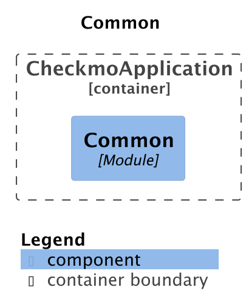
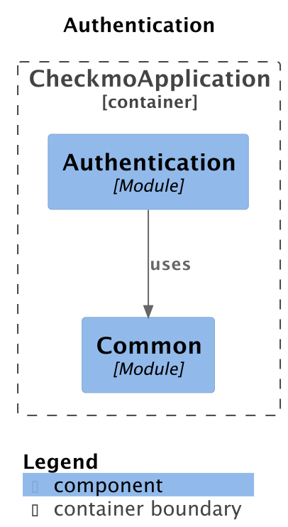
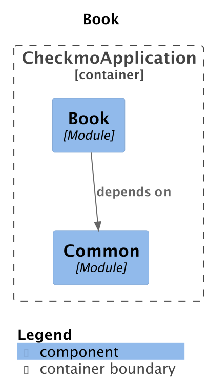
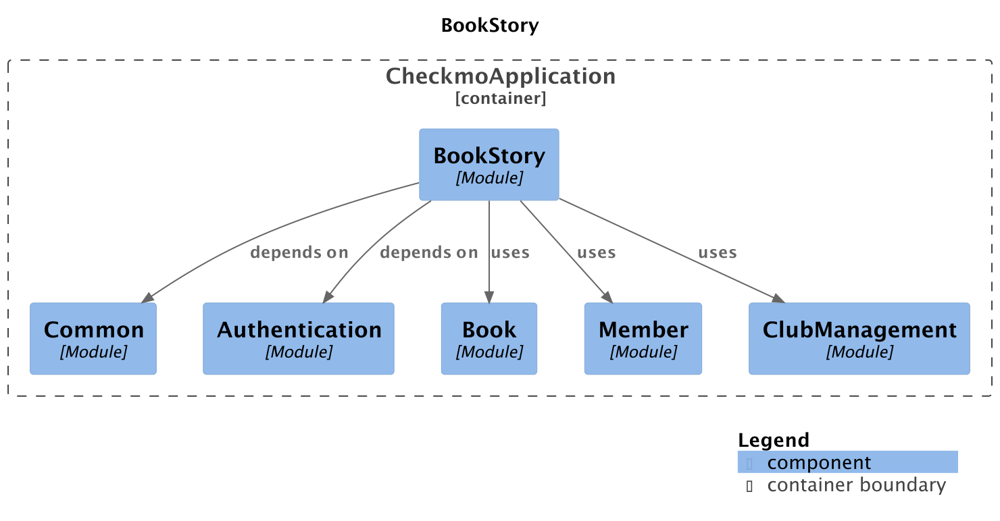
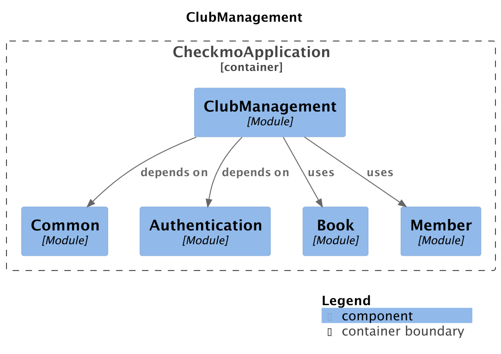
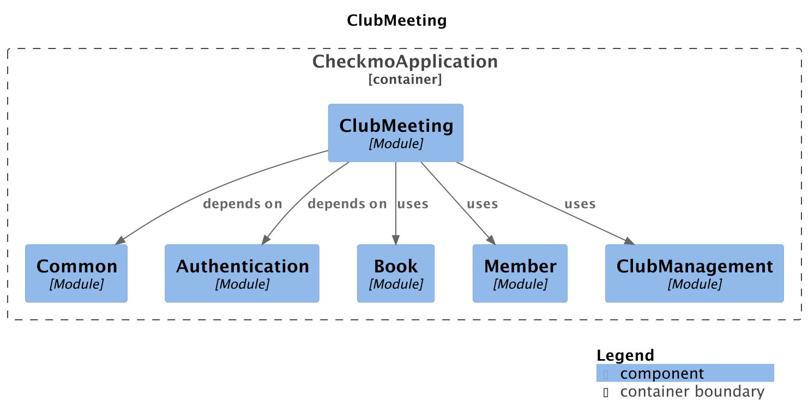
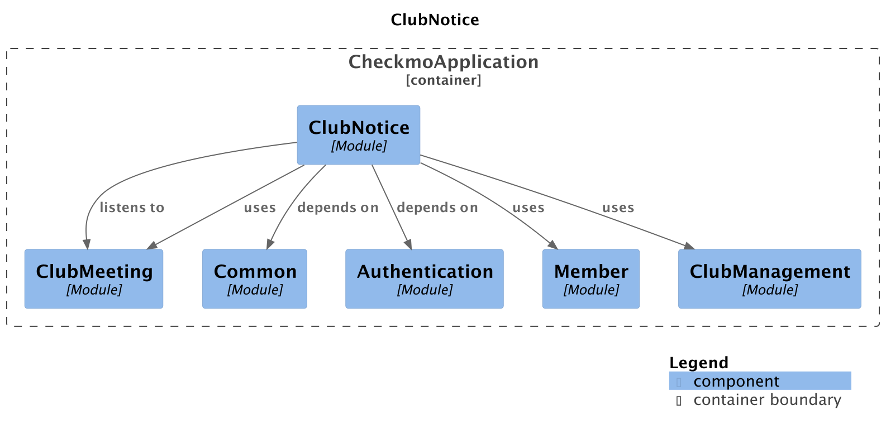
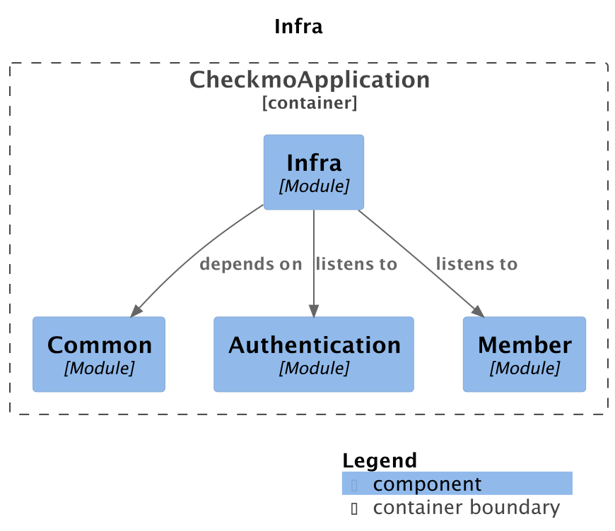
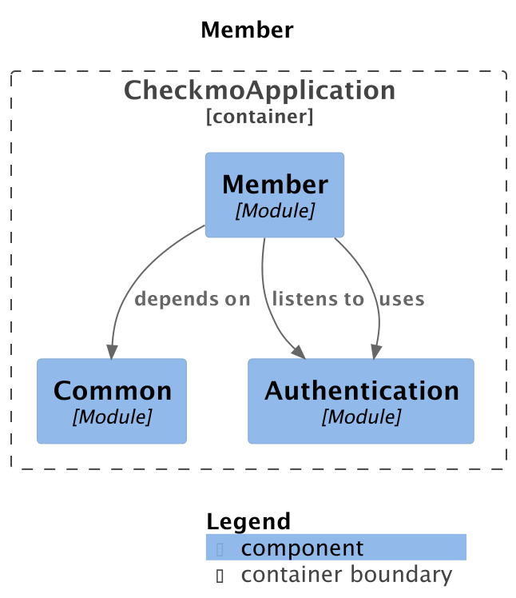
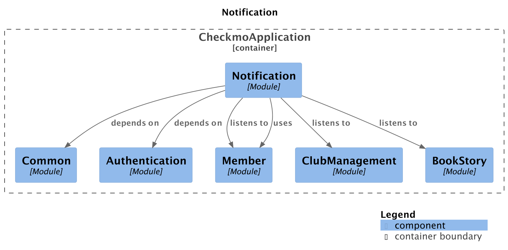

# 📈 Module Architecture Documentation

## 모듈 간 의존성 관계 용어 정리

### 1. **depends on** (의존)

- **컴파일 타임 의존성**을 나타냅니다.
- 다른 모듈의 기본 타입, 유틸리티, 인터페이스, 설정 클래스 등을 **직접 import**하여 사용하는 경우입니다.
- 주로 `Common`, `Authentication` 같은 기반 모듈에 대한 의존성을 표현합니다.

### 2. **uses** (사용)

- **런타임 의존성** 또는 **API 호출 의존성**을 나타냅니다.
- 다른 모듈의 public API 호출하여 비즈니스 로직을 수행하는 경우입니다.
- Spring Modulith에서 명시적으로 허용된 public API만 사용할 수 있습니다.

### 3. **listens to** (이벤트 구독)

- **이벤트 기반 의존성**을 나타냅니다.
- 다른 모듈에서 발행한 이벤트를 구독하여 비동기적으로 처리하는 경우입니다.
- Spring Modulith의 이벤트 처리 방식을 나타냅니다.

---

## Module Graphs

### 1. Module: Common

---

### 2. Module: Authentication

---

### 3. Module: Book

---

### 4. Module: Book Story

---

### 5. Module: Club Management

---

### 6. Module: Club Meeting

---

### 7. Module: Club Notice

---

### 8. Module: Infra

---

### 9. Module: Member

---

### 10. Module: Notification

